# DO1_Linux. Операционные системы UNIX/Linux (Базовый)

Страничка про самые важные системные файлы линуха: <https://wiki.merionet.ru/articles/faily-konfiguracii-linux-polnoe-rukovodstvo>

По факту данный файлик является конспектом штук, изученных при выполнении данного проекта, так что здесь <#многабукф>. Зато красиво :D

Ну и не забывайте перед командами писать `sudo`, я это слово опустила, ибо тавтология — не красиво B)

1. [Установка ОС](#part-1-установка-ос)
2. [Создание пользователя](#part-2-создание-пользователя)
3. [Настройка сети ОС](#part-3-настройка-сети-ос)
	1. [Смена имени компьютера](#1-смена-имени-компьютера)
	2. [Смена часового пояса](#2-смена-часового-пояса)
	3. [Сетевые интерфейсы](#3-сетевые-интерфейсы)
		* [Что за lo и зачем?](#что-за-lo-и-зачем)
	4. [DHCP](#4-dhcp)
	5. [Вывод внешнего и внутреннего шлюзов](#5-вывод-внешнего-и-внутреннего-шлюзов)
	6. [Статичные настройки](#6-статичные-настройки)
	7. [После перезагрузки](#7-после-перезагрузки)
4. [Обновление ОС](#part-4-обновление-ос)
5. [Использование команды sudo](#part-5-использование-команды-sudo)
6. [Установка и настройка службы времени](#part-6-установка-и-настройка-службы-времени)
7. [Установка и использование текстовых редакторов](#part-7-установка-и-использование-текстовых-редакторов)
8. [Установка и базовая настройка сервиса SSHD](#part-8-установка-и-базовая-настройка-сервиса-sshd)
	1. [Установка службы SSH](#1-установка-службы-ssh)
	2. [Добавление автостарта службы при загрузке системы](#2-добавление-автостарта-службы-при-загрузке-системы)
	3. [Перенастройка службы SSH на порт 2022](#3-перенастройка-службы-ssh-на-порт-2022)
	4. [SSHd существует, чесслово, доказываем с помощью ps](#4-sshd-существует-чесслово-доказываем-с-помощью-ps)
	5. [Перезагрузка и netstat (либо ss)](#5-перезагрузка-и-netstat-либо-ss)
9. [Установка и использование утилит top, htop](#part-9-установка-и-использование-утилит-top-htop)
10. [Использование утилиты fdisk](#part-10-использование-утилиты-fdisk)
11. [Использование утилиты df](#part-11-использование-утилиты-df)
12. [Использование утилиты du](#part-12-использование-утилиты-du)
13. [Установка и использование утилиты ncdu](#part-13-установка-и-использование-утилиты-ncdu)
14. [Работа с системными журналами](#part-14-работа-с-системными-журналами)
15. [Использование планировщика заданий CRON](#part-15-использование-планировщика-заданий-cron)

## Part 1. Установка ОС

`cat /etc/issue` — файл, который содержит информацию о системе и сообщение-приветствие, отображаемое перед приглашением ко входу в систему.


## Part 2. Создание пользователя

`cat /etc/passwd` — файл, содержащий в текстовом формате список пользовательских учётных записей (аккаунтов). 

Скриншот вывода до добавления пользователя:

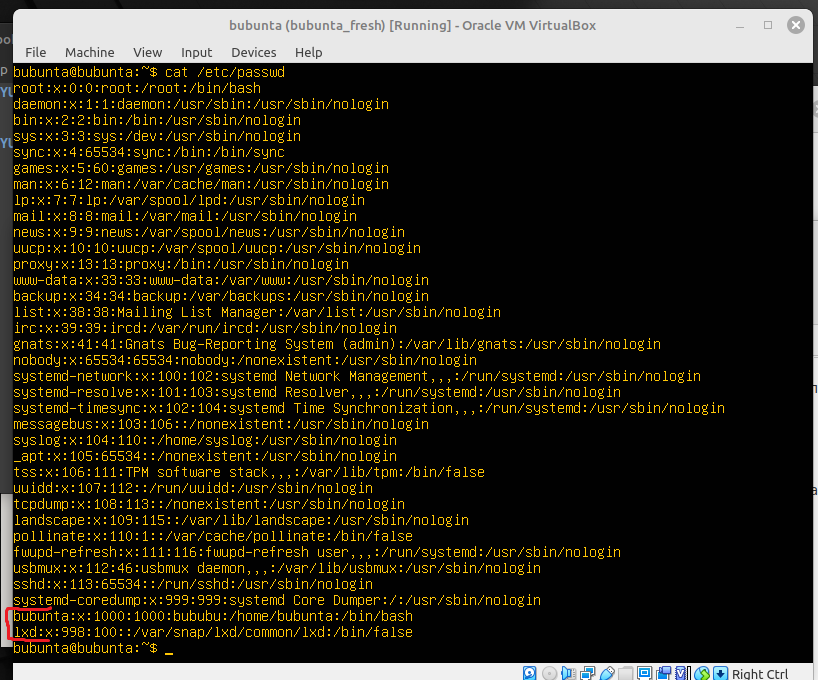

Способы создать пользователя:
1. С помощью `useradd` одной командой (не считая создания пароля):

	`useradd -mU -G adm -s /bin/bash user1`

  * Можно добавить флаг `-p parol` для создания пароля, но это небезопасно, т.к., во-первых, пароль будет виден в истории команд и процессах, во-вторых, у меня **не сработало**. По итогу ещё нужна команда `passwd user1`, она затребует ввести пароль для пользователя.

	`-m` — создание домашнего каталога

	`-U` — создание одноименной группы для пользователя

	`-G` группа — сразу добавляет в группу

	`-s` — оболочка по умолчанию для этого пользователя

2. С помощью `adduser`: 

	`adduser user1`

	`usermod -aG adm user1` — флаг `-a` работает ТОЛЬКО c `-G`. `-aG` отличается от `-G` тем, что `-G` (без `-a`) удаляет пользователя из всех групп, кроме указанных, а `-aG` просто добавляет пользователя в дополнительные группы.

`useradd` — низкоуровневая утилита, `adduser` — надстройка над `useradd`, `groupadd`, `usermod` и создаёт пользователя сразу с паролем, своим каталогом и своей группой.

В результате выполнения команды `adduser` будут выполнены следующие действия:
* Создаётся новый пользователь с именем, которое вы указали при выполнении команды.
* Создаётся группа с тем же именем.
* Создаётся домашний каталог пользователя в директории `/home/имяпользователя`
* В домашний каталог копируются файлы из директории `/etc/skel` */что бы это ни значило/*
* В данной директории хранятся файлы, которые копируются в домашний каталог всех новых пользователей

Чтобы всё это сделать `useradd`-ом, придётся прописать кучу флагов (и ещё `usermod`-ом побаловаться).

Скриншот `useradd`-а:

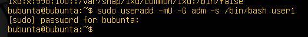

Скриншот вывода после добавления пользователя:

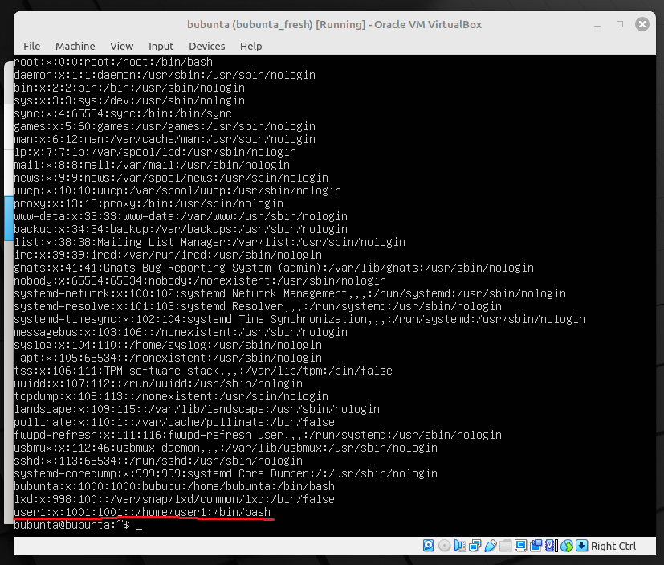

Проверка, добавился ли пользователь:

  а) `cat /etc/passwd | grep user1`

  б) `id user1` — выведет id пользователя, id группы пользователя и список его групп в целом.


## Part 3. Настройка сети ОС 

### 1. Смена имени компьютера

Вывести имя компьютера можно с помощью `hostname` или `hostnamectl`. 

Способы изменить настоящий hostname:
1. `hostnamectl set-hostname user-1`
2. Ручное редактирование файлов `/etc/hostname` и `/etc/hosts`

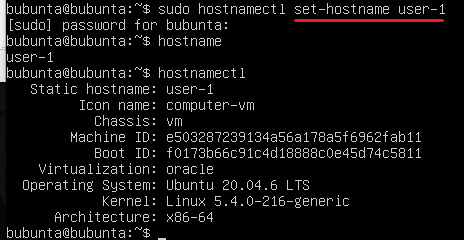

В консоли видно после перезагрузки: 

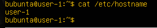

3. `hostname user-1` — меняет hostname ТОЛЬКО на время ТЕКУЩЕЙ СЕССИИ, т.е. после перезагрузки вернётся настоящее имя. Причём `hostname` выведет только текущее имя, а `hostnamectl` выведет оба имени — оригинальное статическое (static) и временное на следующей строке (transient).

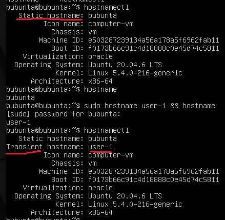

Команда `hostnamectl` в принципе позволяет управлять именем компьютера. Опции:
* `status` — настройки текущего имени (писать не обяз, всё равно выведется)
* `set-hostname NAME` — изменение имени (--static, --transient, --pretty)
* `set-icon-name NAME` — AI говорит: icon name в hostnamectl — это метаинформация для удобства визуального представления хоста в графических интерфейсах, не влияющая на сетевые или системные параметры имени хоста напрямую.
* `set-chassis NAME` — тип компьютера? desktop, server, vm и т.п. Ещё какая-то метаинфа.
* и др.
В новых версиях ОС вроде без `set-штото NAME`, а просто `штото NAME`.

### 2. Смена часового пояса

Посмотреть текущий часовой пояс можно с помощью `date`, `timedatectl`, `cat /etc/timezone` и `ls -l /etc/localtime` (`-l` — вывод с владельцем, группой, датой создания, размером и др.)

`/etc/localtime` — символьная ссылка или копия двоичного файла данных о часовых поясах, используемого Linux для определения текущего местного времени. `ls -l /etc/localtime` выводит, на какой файл (с каким часовым поясом) ссылается localtime. 
Например, `/etc/localtime -> /usr/share/zoneinfo/Europe/Moscow`

<details><summary>Лирическое отступление о том, что такое символьные ссылки и как вообще в линухе хранятся файлы</summary>

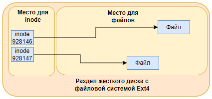

Каждый файл содержит данные, а данные О ФАЙЛЕ хранятся в **inode**. 

**Индексный дескриптор (Inode)** — это структура данных в которой хранится информация о файле или директории в файловой системе (метаданные с типом, датой создания, владельцем, правами и т.п.) У каждого inode свой *уникальный номер* и связывается с определенным *набором блоков*. А имена файлов чисто чтоб нам было проще их воспринимать.

***Символьная ссылка*** — файл, который указывает на другой файл (как ярлыки в windows).

Вообще ссылок 2 вида (создаются с помощью `ln`): 
* Жёсткая — дополнительная запись в каталоге указывающая на уже созданный inode. `ln файл_на_который_ссылаются ссылка`
* Символьная — запись в каталоге указывающая на *свой отдельный* inode, но при чтении ссылающая на другой файл. При этом ссылается на другой файл по имени а не по inode. Создаётся с помощью флага `-s`

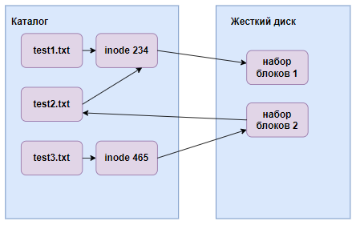

Есть файл с именем **test1.txt** и он имеет свой уникальный индексный дескриптор (**inode 234**), который ссылается на набор блоков (набор блоков 1) на жестком диске.

Файл **test2.txt** — это жёсткая ссылка. То есть, просто дополнительное имя файла, которое ссылается на тот же *inode* что и **test1.txt**.

Файл **test3.txt** — это символьная ссылка. Этот файл имеет свой индексный дескриптор (**inode 465**), и обращается к своему набору блоков (набор блоков 2). Этот файл является файлом отдельного типа *(символьная ссылка / symbolic link)* и в наборе данных у таких файлов записан путь к файлу на который она ссылается. То есть, в файле **test3.txt** указано что ссылаться нужно на **test2.txt**. При этом, если удалить файл **test2.txt** и попробовать прочитать **test3.txt** то увидим ошибку, так как ссылка не найдёт файл на который она ссылается, такую ссылку называют битой ссылкой.

2 шикарные статьи с бОльшим кол-вом подробностей: про файловую систему <https://sysadminium.ru/file_types_in_linux/> и про ссылки <https://sysadminium.ru/adm_serv_linux-links_in_linux/>
</details>

Способы сменить временную зону

1. `timedatectl set-timezone Europe/Moscow` (список доступных часовых поясов можно посмотреть через `list-timezones`)
2. Ручное редактирование ссылки `/etc/localtime`. Сначала её придётся удалить: `unlink /etc/localtime`, затем создать заново для нужного пояса `ln -s /usr/share/zoneinfo/Europe/Moscow /etc/localtime`. НО (!!!) файл `/etc/timezone` остаётся прежним, вроде это нормально, т.к. данный файл хранит просто текстовое представление временной зоны.
3. Чтобы установить часовой пояс только для ТЕКУЩЕЙ СЕССИИ в терминале, используется команда: `export TZ=Europe/Moscow`

`TZ` — переменная окружения. Можно задать часовой пояс для одной программы: `TZ=Europe/Moscow программа`

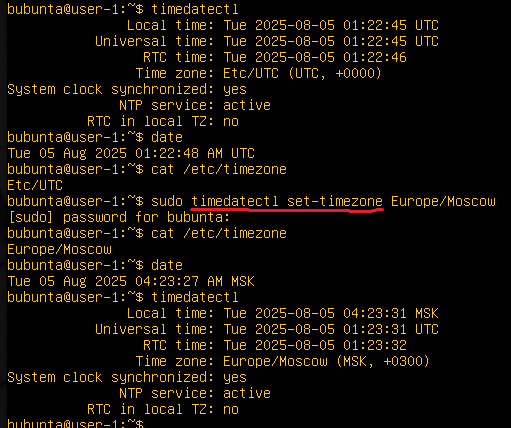

### 3. Сетевые интерфейсы

Способы вывести названия интерфейсов (<https://www.geeksforgeeks.org/linux-unix/how-to-list-network-interfaces-in-linux/#using-nmcli-to-list-network-interfaces-in-linux>, <https://losst.pro/spisok-setevyh-interfejsov-linux#toc-3-utilita-ip>):

0. `ls /sys/class/net`

	`/sys/class/net` — каталог в виртуальной файловой системе /sys операционной системы Linux, который содержит символические ссылки на все сетевые интерфейсы, обнаруженные системой.

1. Утилита `ip`: `ip [-br] link show`, `ip addr`
2. `cat /proc/net/dev` — выводит подробную таблицу сетевых интерфейсов со статистикой их использования (количество полученных и переданных байтов и пакетов). Файл «/proc/net/dev» — это виртуальный файл, который предоставляет информацию о сетевых устройствах на уровне ядра.

Требуют установки :

3. `ifconfig` (установить net-tools) — выводит список сетевых интерфейсов и такую информацию о них, как состояние, IP адрес, MAC адрес и другие параметры
4. `netstat -i` (установить net-tools)

	`netstat` — утилита, предназначенная для мониторинга сетевых подключений, таблиц маршрутизации, интерфейсов и статистики. 

	Флаг `-i` выводит информацию о сетевых интерфейсах и статистику по переданным данным.

5. `nmcli device status` (установить network-manager) — выводится подключение NetworkManager, связанное с конкретным устройством, а также его состояние.

<details><summary>Лирическое *сжатое* отступление о командах, выполняющих эту задачу, но предназначенных для вывода информации о железе</summary>

6. `hwinfo --short --network`

	`hwinfo` — программа для получения информации об оборудовании, которая может быть использована для сбора подробных сведений о различных аппаратных компонентах в системе Linux. Без `--short` вывод огромен.
7. `lshw -class network -short` — настойчиво требует sudo

	`lshw` извлекает данные из файлов в `/proc` каталоге и может предоставлять информацию о широком спектре компонентов, включая CPU, память, кэш-память, версию прошивки и др.

	`-class` — используется для отображения конкретного класса оборудования.
8. `iwconfig` — настройка и управление беспроводными сетями. 
9. `lspci | egrep -i 'network|ethernet|wireless|wi-fi'` фильтрует вывод команды `lspci`, чтобы отображались только строки, содержащие слова «network», «ethernet», «wireless» или «wi-fi». В результате получается краткий список устройств PCI, связанных с сетью, что упрощает идентификацию сетевых интерфейсов и соответствующего оборудования в системе.
	
	`lspci` отображает список всех PCI-шин и устройств, подключенных к ним. Среди них могут быть VGA-адаптеры, видеокарты, NIC, USB, SATA-контроллеры и прочие.

</details>

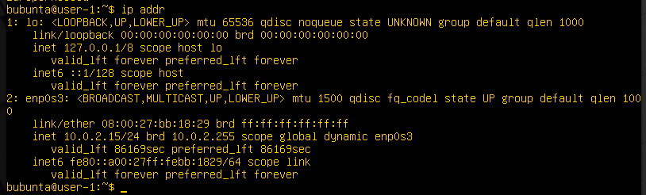

#### Что за lo и зачем?

lo (loopback device/Локальная петля) – виртуальный интерфейс, присутствующий по умолчанию в любом Linux. Он используется для отладки сетевых программ и запуска серверных приложений на локальной машине. С этим интерфейсом всегда связан адрес 127.0.0.1. У него есть dns-имя – localhost. Посмотреть привязку можно в файле `/etc/hosts`.

Если физические сетевые порты по какой-то причине не будут работать, компьютер не сможет никак ни с чем связаться, даже с самим собой. Но благодаря lo — физически не подсоединённому ни к какой сети (и вообще он и так чисто виртуальный) — машина сможет связаться хотя бы сама с собой. 
Также он может быть использован сетевым клиентским программным обеспечением, чтобы общаться с серверным приложением, расположенным на том же компьютере. То есть если на компьютере, на котором запущен веб-сервер, указать в веб-браузере URL http://127.0.0.1/ или http://localhost/, то он попадает на веб-сайт этого компьютера. Этот механизм работает без какого-либо активного подключения, поэтому он полезен для тестирования служб, не подвергая их безопасность риску, как при удаленном сетевом доступе. Подобным образом, пингование адреса loopback — это основной тест функционирования IP стека в операционной системе.

### 4. DHCP

Dynamic Host Configuration Protocol (DHCP) — протокол динамической настройки узла. DHCP — протокол прикладного уровня, автоматически предоставляющий хостам IP-адрес и другую информацию о конфигурации (маска подсети, адрес маршрутизатора, DNS-адрес и т.п.) 

<details><summary>Лирическое отступление о Даше-путешественнице или как DHCP-сервер раздаёт IP</summary>

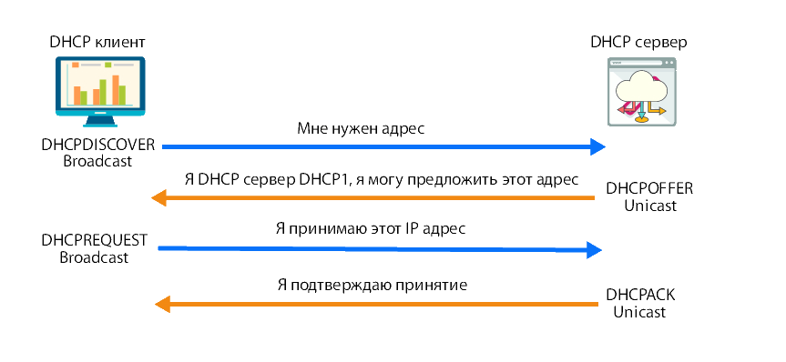

Эти вещи нагляднее в Wireshark (привет, кибербез-2)

Процесс получения IP-адреса клиентом от сервера DHCP включает в себя 4 этапа — DORA:

1. Discover — Обнаружение. Вначале клиент выполняет широковещательный запрос по всей физической сети с целью обнаружить доступные DHCP-серверы. Он отправляет сообщение типа DHCPDISCOVER (значение опции «Тип сообщения» — 1).

	Источник: 0.0.0.0 (если компьютер ещё не имеет собственного IP-адреса), адрес назначения: 255.255.255.255

2. Offer — Предложение. Получив сообщение от клиента, сервер определяет требуемую конфигурацию клиента в соответствии с указанными сетевым администратором настройками. Сервер отправляет ему ответ DHCPOFFER (значение опции «Тип сообщения» — 2), в котором предлагает конфигурацию (IP, время использования IP-адреса, DNS и т.п.). Это сообщение DHCP-сервер отправляет хосту, пославшему DHCPDISCOVER, на его MAC, при определенных обстоятельствах сообщение может распространяться как широковещательная рассылка. Клиент может получить несколько различных предложений DHCP от разных серверов; из них он должен выбрать то, которое его «устраивает». 

	Источник: DHCP-сервер, адрес назначения: 255.255.255.255 (если dhcp-серверов много)

3. Request — Запрос. Выбрав одну из конфигураций, предложенных DHCP-серверами, клиент отправляет запрос DHCPREQUEST (значение опции «Тип сообщения» — 3). Он рассылается широковещательно (в сети может быть много DHCP-серверов, но клиент примет запрос, который поступит первым, и отправит широковещательное сообщение, чтобы исключить другие DHCP-серверы). Этот же запрос используется, когда время аренды адреса подходит к концу, для продления времени (renewing) или процедуры перепривязки (rebinding). В случае продления времени запрос отправляется не широковещательно, а адресно на выдавший сервер. Только если сервер не отвечает в течение отведённого времени, инициируется процедура перепривязки с широковещательными запросами. Также запрос используется для инициализации после перезагрузки клиента (init-reboot), когда ему уже известен ранее назначенный адрес. В таком случае DHCPDISCOVER не выполняется, а сразу отсылается широковещательный DHCPREQUEST.

	Источник: 0.0.0.0 (т.к. сервер ещё не назначил клиенту адрес.), адрес назначения: 255.255.255.255

4. Acknowledge — Подтверждение. Наконец, сервер подтверждает запрос и направляет подтверждение DHCPACK (значение опции «Тип сообщения» — 5) клиенту. После этого клиент должен настроить свой сетевой интерфейс, используя предоставленные опции. 

	Источник: DHCP-сервер, адрес назначения: 255.255.255.255

DORA THE EXPLORER
</details>

Сначала удалим ip с нашего интерфейса `ip addr del 10.0.2.15/24 dev enp0s3`. Всё, пусто.

Вообще пишут команду `sudo dhclient -r enp0s3`, но у меня она ничего не удалила.

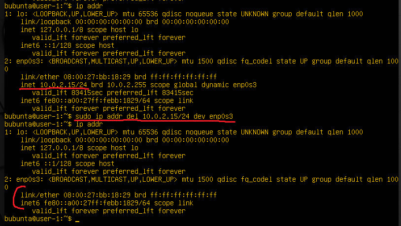

Получаем адрес от DHCP-сервера:

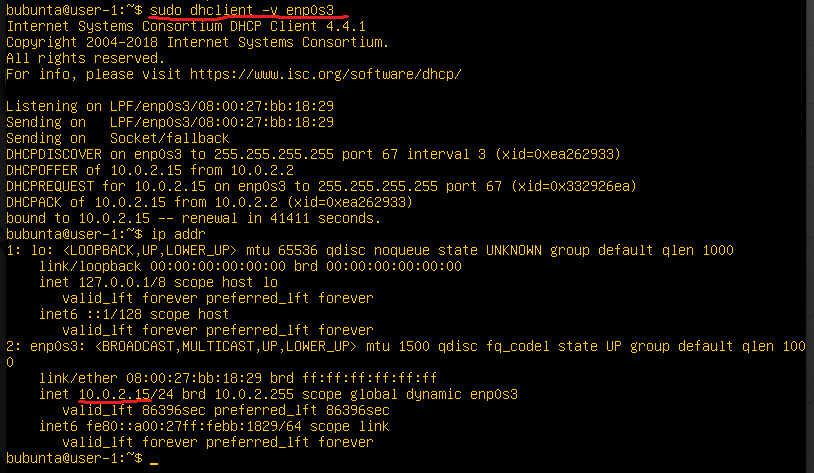

Такой же в общем-то.

### 5. Вывод внешнего и внутреннего шлюзов

Таблицу маршрутизации можно посмотреть с помощью `routel` (подробно) и `ip route` (кратко). В ней хранятся IP адрес цели (target), IP адрес шлюза (gateway), IP отправителя (source), протокол, и сетевые интерфейсы. Внутренний шлюз — default — 10.0.2.2

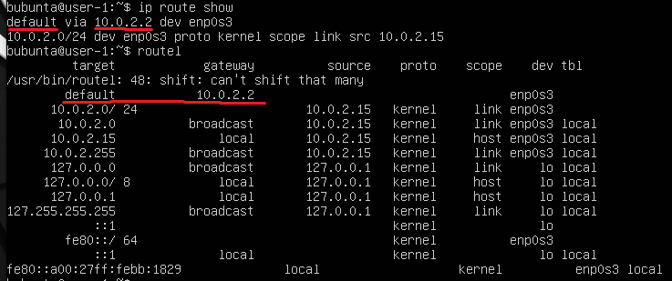

<details><summary>Лирическое отступление об ip route /коротенькое/</summary>

Команда `ip route` в Linux используется для работы с таблицей маршрутизации операционной системы. Она позволяет просматривать текущие маршруты, добавлять новые, изменять или удалять существующие:

* `ip route add <network>/<mask> via <gateway>`
* `ip route del <network>/<mask> via <gateway>`
* `ip route change <network>/<mask> via <new_gateway>`

<https://hostpro.by/blog/samye-populyarnye-komandy-linux-cherez-teriminal-chast-2>
</details>

Внешний шлюз можно посмотреть с помощью `curl ifconfig.me` и обычно является внешним адресом роутера.


И это IP-адрес хоста (реального компа, на котором лежит виртуалка), скриншот из браузера с сайта ifconfig.me


### 6. Статичные настройки

**Netplan** — это утилита для конфигурации сети в современных дистрибутивах Linux. Она позволяет управлять сетевыми настройками с помощью файлов YAML. Все её конфигурационные файлы хранятся в папке `/etc/netplan`.

Чтобы задать статичные настройки, заходим туда.

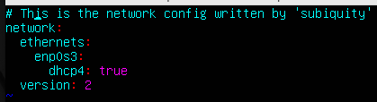

Видно, что интерфейс enp0s3 получает ip от dhcp-сервера. Отключаем эту опцию и прописываем свой адрес, шлюз и dns. Применяем настройки с помощью `sudo netplan apply`

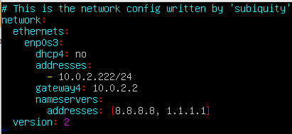

### 7. После перезагрузки

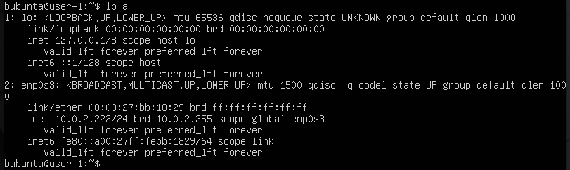

Пингует! И 1.1.1.1, и 8.8.8.8, и ya.ru

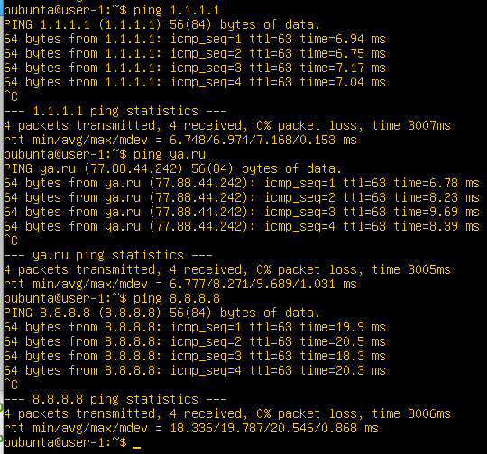

## Part 4. Обновление ОС

Up to date ._.

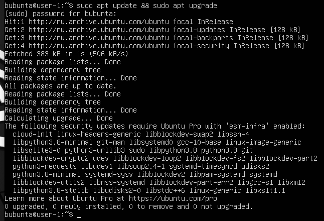

## Part 5. Использование команды sudo

`sudo` (**S**ubstitute **U**ser and **do**, дословно «подменить пользователя и выполнить») — программа для системного администрирования UNIX-систем, позволяющая делегировать те или иные привилегированные ресурсы пользователям с ведением протокола работы.

Программа `sudo` настраивается через файл `/etc/sudoers`. Прокачанная версия `su -`. <https://acm.bsu.by/wiki/Unix2017b/Пользователи_и_права#su_.D0.B8_sudo>

Способы дать пользователю права на `sudo`:
1. Добавление пользователя в группу `usermod -aG sudo user1`
2. Создание файла в `/etc/sudoers.d/`: `vim /etc/sudoers.d/user1/`, записывание туда строки `user1 ALL=(ALL:ALL) ALL`. В группу не добавляется.
3. Прямое редактирование `/etc/sudoers` (ОПАСНО, МОЖНО ПОЛОМАТЬ SUDO ВСЕМ): `sudo visudo`, записывание в конец той же строки. В группу не добавляется.

Меняем пользователя через `su - user1` и оттуда меняем hostname.

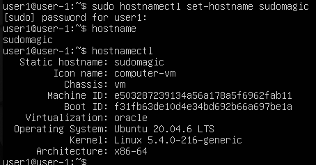

## Part 6. Установка и настройка службы времени

Подозреваю, что задача была на службы ntp и systemctl. Ну, всё хорошо :D

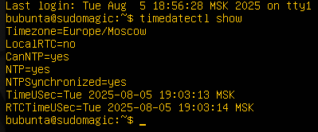

## Part 7. Установка и использование текстовых редакторов

	Vim: `vim test_VIM.txt`, нажать `i` — войти в режим записи. `:w` — сохранить, `:q` — выйти, `:wq` — выйти и сохранить.

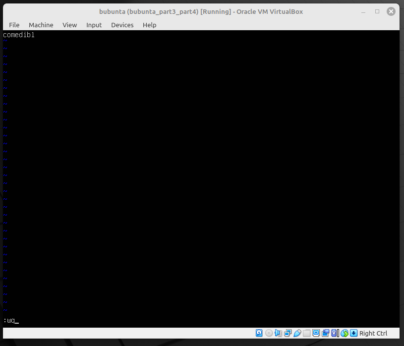

	Nano: `nano test_NANO.txt`, `Ctrl+O` — сохранение, `Ctrl+X` — выход. Можно просто выйти и перед выходом на вопрос о сохранении нажать Y.

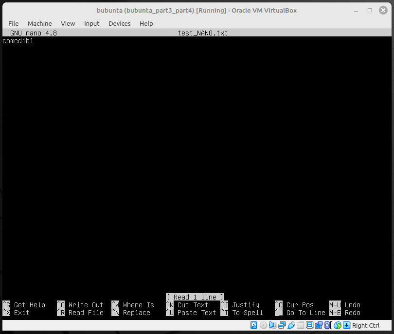

	MCEdit: `mcedit test_MCEDIT.txt` (требует `apt install mc`), `F2` — сохранение, `F10` — выход. 
	Можно просто выйти и перед выходом на вопрос о сохранении нажать Yes.

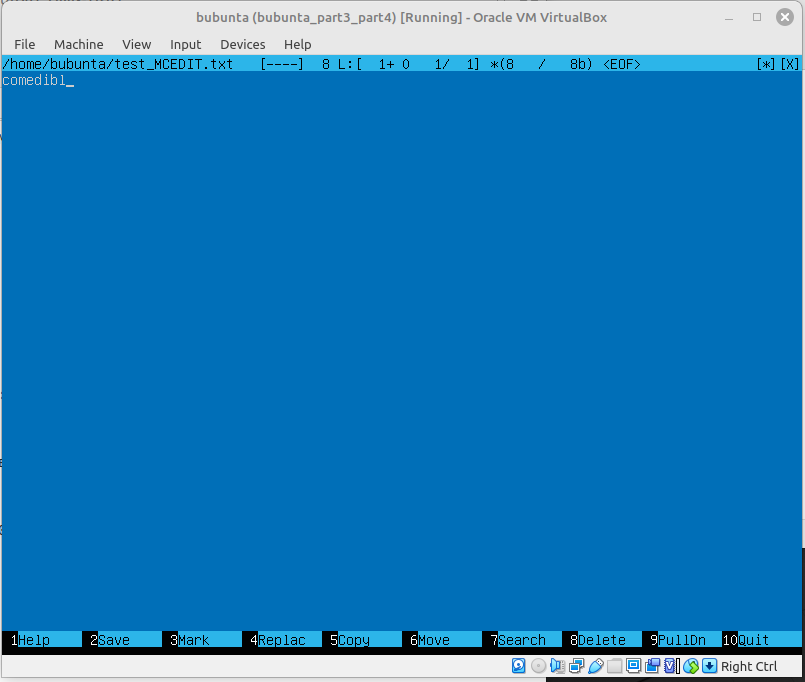

Выход без сохранения

	Vim: `:q!`

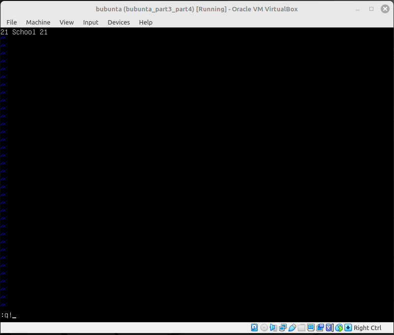

	Nano: `Ctrl+X` & No

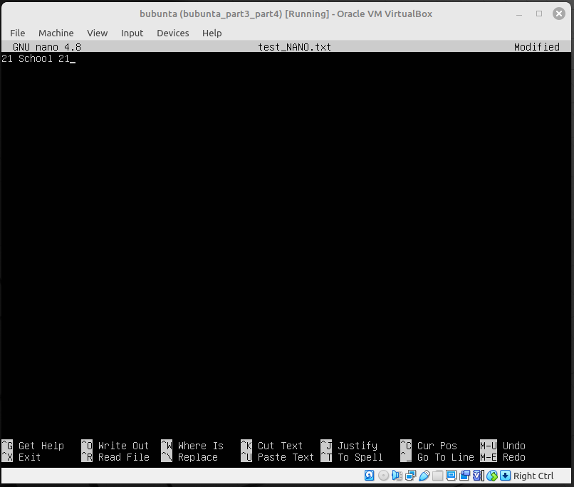

	MCEdit: `F10` & No

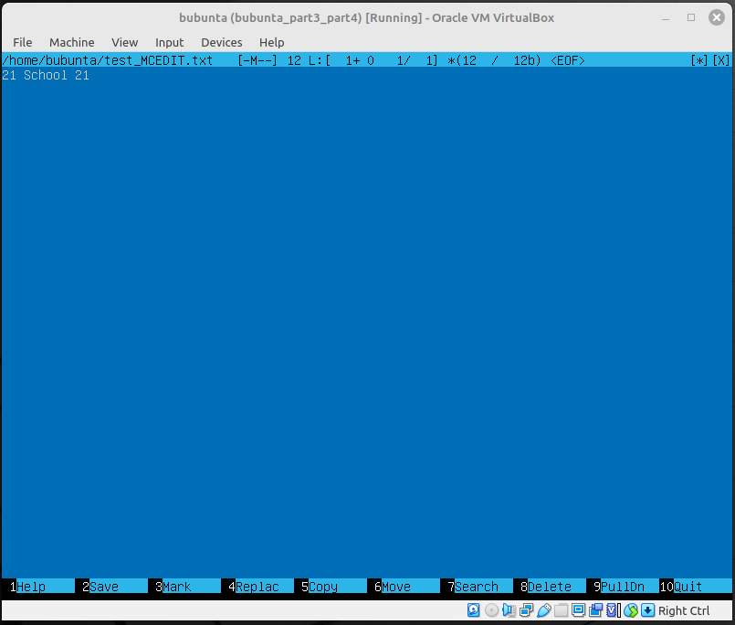

Поиск:

	Vim: `/pattern` (БЕЗ `:`, СРАЗУ `/`)


	Nano: `Ctrl+W`

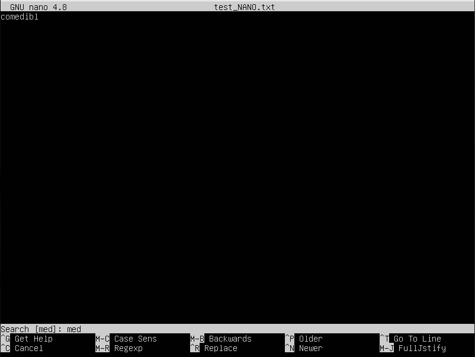

	MCEdit: `F7`

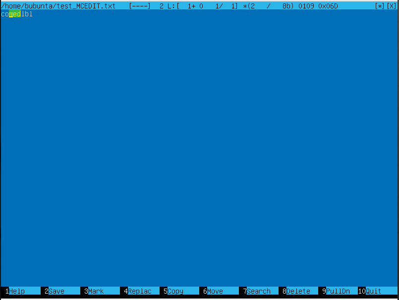

Замена:

	Vim: `:s/search/stringtoreplace`

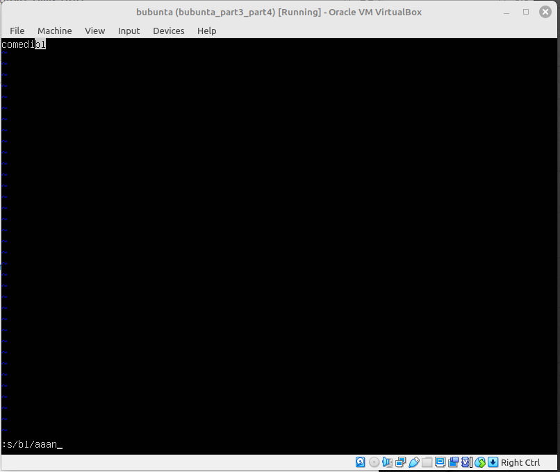

	Nano: `Ctrl+\ stringtoreplace` & Yes

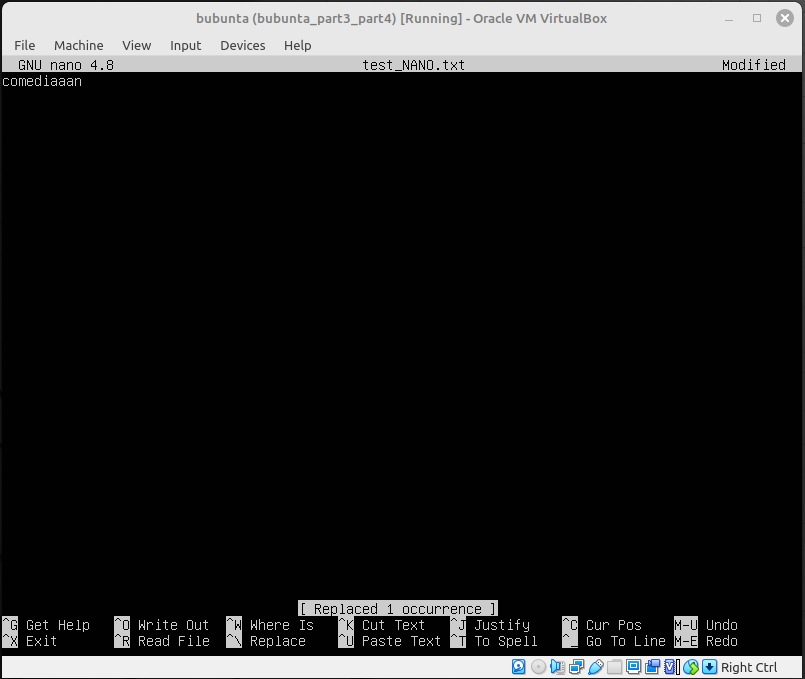

	MCEdit: `F4` & `stringtoreplace` & Yes

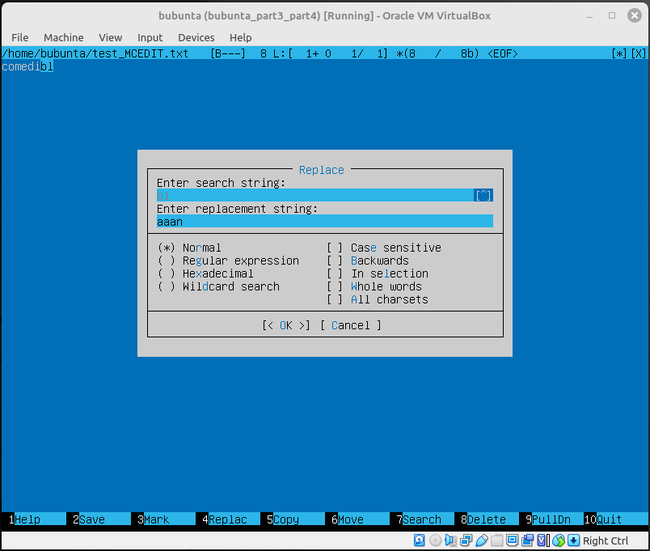

## Part 8. Установка и базовая настройка сервиса SSHD

**SSH** (англ. **S**ecure **Sh**ell — «безопасная оболочка») — сетевой протокол прикладного уровня, позволяющий производить удалённое управление операционной системой и туннелирование TCP-соединений (например, для передачи файлов). Схож по функциональности с протоколами Telnet и rlogin, но, в отличие от них, шифрует весь трафик, включая и передаваемые пароли. SSH позволяет безопасно передавать в незащищённой среде практически любой другой сетевой протокол.

### 1. Установка службы SSH

`apt install ssh openssh-server`

### 2. Добавление автостарта службы при загрузке системы

Добавление автостарта службы при загрузке системы: `sudo systemctl enable ssh`. Перезагружаем систему и смотрим статус: `systemctl status ssh`.

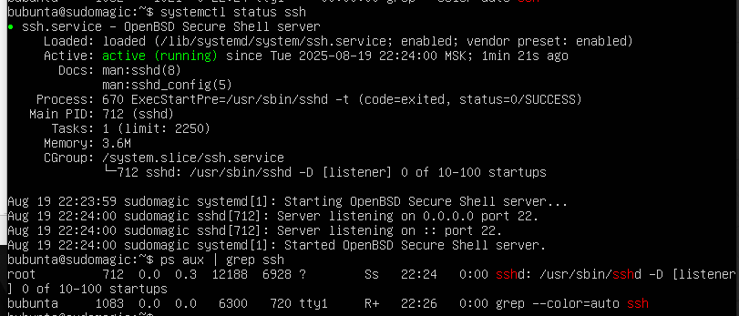

1. Информация о сервисе

	`ssh.service` — OpenBSD Secure Shell server — ДЕМОН (фоновый сервис) 😈 для SSH-сервера.

	`Loaded: loaded (/lib/systemd/system/ssh.service; enabled; vendor preset: enabled)`

	`loaded` — сервис загружен в память `systemd` (менеджер служб в Linux).

	`enabled` — сервис настроен на автозапуск при загрузке системы. Это важная настройка для сервера, к которому нужно подключаться удаленно.

	`vendor preset: enabled` — такое состояние (включен) было задано по умолчанию разработчиками дистрибутива (например, Ubuntu).

2. Состояние сервиса

	`Active: active (running) since Tue 2025-08-19 22:24:00 MSK; lmin 21s ago`

	`active (running)` — сервис работает прямо сейчас, без ошибок.

	`since Tue 2025-08-19 22:24:00 MSK` — он был запущен в эту дату и время.

	`1min 21s ago` — а момент выполнения команды сервис работал 1 минуту и 21 секунду.

3. Процесс и ресурсы

	`Main PID: 712 (sshd)` — главный процесс сервиса имеет идентификатор (PID) 712, и это исполняемый файл sshd.

	`Tasks: 1` — в данный момент с этим сервисом связана 1 задача (главный процесс).

	`Memory: 3.6M` — процесс использует примерно 3.6 мегабайта оперативной памяти. 

	`CGroup: /system.slice/ssh.service` — процесс находится в своей контрольной группе (cgroup), которая помогает *systemd* управлять ресурсами.

4. Журнал (лог) последних событий

	В нижней части вывода показываются записи в системном журнале, относящиеся к этому сервису.

	:: = 0.0.0.0, но для IPv6-адресов.

Атлишна.

### 3. Перенастройка службы SSH на порт 2022

Для смены порта SSH на 2022 заходим в `/etc/ssh/sshd_config` и меняем там номер порта на нужный (не забыв **раскомментить**). 

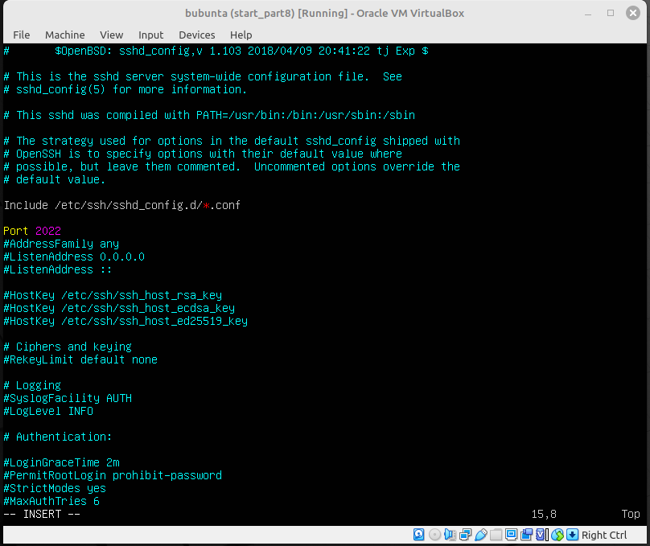

<details><summary>Лирическое преступление о том, как с хоста (реального компа) подключаться к виртуалке, чтоб можно было копипастить команды, а не забивать вручную */вручную, впрочем, полезнее/*</summary>

0. Разрешаем аутентификацию под root-пользователем (В РЕАЛЬНОЙ ЖИЗНИ НЕ ПОВТОРЯТЬ): раскомментируем `PermitRootLogin`, пишем `yes` и закомменчиваем `prohibit-password` а-за-за-за
1. Разрешаем аутентификацию по ключу и паролю: тупо раскомменчиваем соответствующие строки.

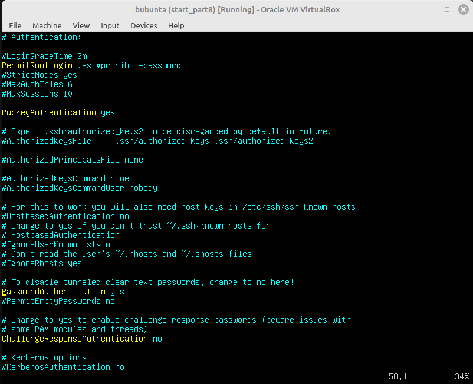

Но ещё надо настроить порты в VirualBox.

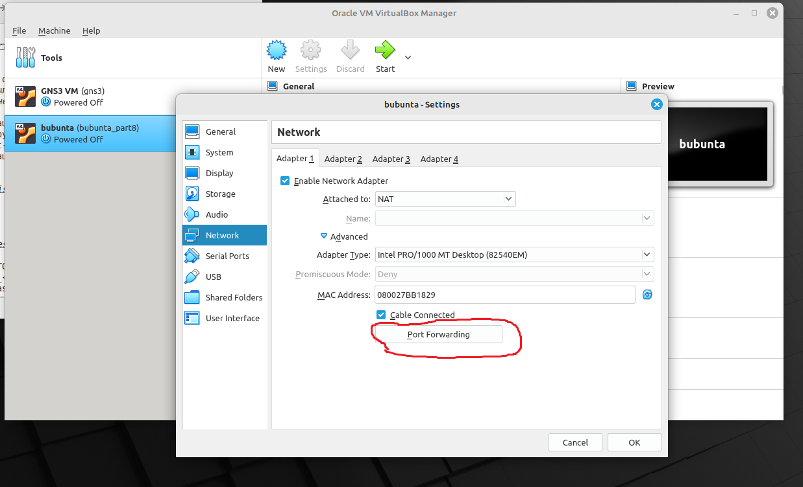

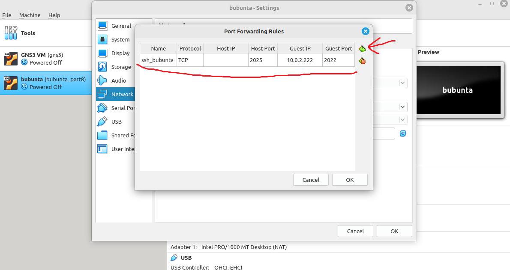

* Адрес хоста: оставляем пустым или указываем 127.0.0.1.
* Порт хоста: любой свободный порт на вашей основной системе, например, 2025 в честь нынешнего года :D /если параноите, на linux с помощью `ss -tuln` можно посмотреть занятые порты, на windows хз, и так сойдёт xD /
* Адрес гостя: IP адрес, который был присвоен вашей виртуальной машине. Обычно это 10.0.2.15, но в одном из-заданий я задала статический 10.0.2.222. /а вообще тут вроде не обязательно ничего указывать, но я указала/
* Порт гостя: порт SSH на виртуальной машине, по умолчанию – 22, **но у нас 2022**.

Заходим в терминал хоста, не забыв включить виртуалку, разумеется, вводим `ssh имя_пользователя@localhost -p ваш_порт` и радуемся жизни!

PROFIT!!!

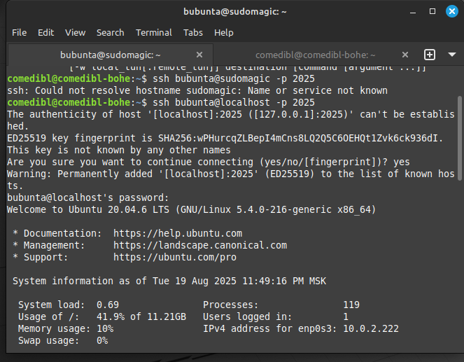

<details><summary>Но можно авторизоваться по всем канонам, по тру ssh-ключу, а не паролю.</summary>

Для этого на нашем компе заходим в терминал (у меня linux), заходим в папку `.ssh` (~/.ssh) и генерируем ключ с помощью `ssh-keygen`. Можно сразу в `.ssh`, а можно создать там новую папку чисто под наши ключи: `cd ~/.ssh && mkdir vmkey && cd vmkey && ssh-keygen` (наверное, по идее, это безопаснее? **Просто есть нюансик насчёт config-а**)

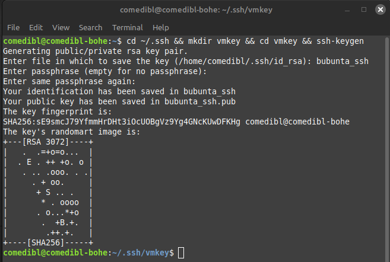

Передаём ключ виртуалке: `ssh-copy-id -i ваш_ключ.pub -p ваш_порт имя_пользователя@localhost` — и всё, уже можно по ключу подключаться ^_^

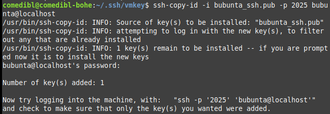

Проверка наличия ключа (на виртуалке): `cat ~/.ssh/authorized_keys`

И можно закомментировать `PasswordAuthentication`, НО надо раскомментировать `AuthorizedKeysFile`

По идее, уже всё подключается без проблем, но ТОЛЬКО ЕСЛИ ВЫ НЕ СОЗДАВАЛИ ОТДЕЛЬНУЮ ПАПКУ ПОД КЛЮЧИ. Потому что SSH-клиент по умолчанию ищет приватные ключи только в стандартных файлах в папке `~/.ssh/` — подпапки не в счёт 🤡 Поэтому пара слов о `config`-файле.

Файл конфигурации SSH — это мощный инструмент, который позволяет создавать ярлыки для SSH-подключений. Считайте его своей адресной книгой SSH, в которой можно хранить данные о подключении ко всем вашим компьютерам.

`vim ~/.ssh/config` — создаём. Самый минимум просто чтоб SSH-демон начал видеть ключи в подпапке:

```
Host localhost
  IdentityFile ~/.ssh/bubunta/bubunta_ssh
```

А вообще в файле конфигурации много опций:

* `Host` — your chosen nickname for the connection
* `HostName` — the actual IP address or hostname
* `User` — your username on the remote system
* `Port` — SSH port (default is 22)
* `IdentityFile` — path to your SSH key
* `ForwardX11` — enable X11 forwarding for GUI applications

Образцовые образцы:

```
# Basic VM connection
Host ubuntu-vm
	HostName 192.168.1.100
	User ubuntu
	Port 22

# NAT VM connection using localhost
Host nat-vm
	HostName localhost
	User developer
	Port 22

# VM with custom settings
Host dev-vm
	HostName 192.168.1.101
	User developer
	Port 2222
	IdentityFile ~/.ssh/dev_key
	ForwardX11 yes
```

Безопасности ради можно настроить права: `chmod 600 ~/.ssh/config`

`chmod`: **ch**ange **mod**e command — полномочия
`600`:
* `6` for owner = read (4) + write (2)
* `0` for group = no permissions
* `0` for others = no permissions
</details>

PROFIT!!! x2


ЛУЧШИЙ ГАЙД, СПАСИБИЩЕ АВТОРУ!!! Сорян, что прячу тебя под отступлением, мало ли >_< <https://github.com/codesshaman/sber_devops_d01_linux-master/blob/main/00_INSTALL_SYSTEM.md> — описано БУКВАЛЬНО ВСЁ. Некоторые шаги мне, кстати, даже не понадобились, но мало ли.

Но тут самый минимум про подключение по паролю <https://comp-security.net/подключиться-к-виртуальной-машине-по-ssh/>

Более подробно о подключении к виртуалке через сгенерированный ssh <https://gist.github.com/anupkrbid/e894af7df2d43a4e253fc252251dd7fe>
</details>

Restart~ `sudo systemctl restart ssh`. 

### 4. SSHd существует, чесслово, доказываем с помощью ps

Проверяем наличие процесса с помощью `ps -ef | grep ssh` или `ps aux` (`ps` выводит отчёт о работающих процессах). `aux` выводит *подробную* информацию обо всех процессах (user, cpu, mem и т.п.)


Основные флаги `ps`:

* `-e` — вывести *краткую* информацию обо всех процессах (не только текущего пользователя)
* `-a` — вывести информацию обо всех наиболее часто запрашиваемых процессах
* `-t` — показывать только процессы из этого терминала
* `-p` — показывать информацию только об указанном процессе
* `-u` — показывать процессы только определенного пользователя
* `-f` — вывести в полном формате (UID, PID, родительский PID, время запуска и команду).

### 5. Перезагрузка и netstat (либо ss)

Restart~ `sudo systemctl restart ssh`. 

`netstat -tan`:
* `-t` — показывать только TCP-соединения
* `-a` — отображать все соединения (включая слушающие порты)
* `-n` — выводить IP и порты в числовом формате (без преобразования в домены)

Столбцы `netstat`:
* Protocol — тип транспортного протокола (tcp = IPv4, tcp6 = IPv6, udp = IPv4, raw = RAW-сокеты)
* Recv-Q — количество байтов, не скопированных локальным приложением (должен быть 0)
* Send-Q — количество байтов, не подтвержденных удаленным хостом (должен быть 0)
* Local Address — адрес и номер порта локального конца сокета
* Foreign Address — адрес и номер порта удаленного конца сокета
* State — состояние TCP-соединения. LISTEN = ожидает подключений, ESTABLISHED = активное соединение, TIME_WAIT = завершённое

**0.0.0.0** — это немаршрутизируемый IP-адрес, который не связан с каким-либо конкретным физическим устройством. Т.е. это **все сетевые интерфейсы**, крик на всю Ивановскую, ор на весь мир, всю вселенную.

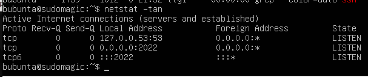

<details><summary>Лирическое отступление о сокетах</summary>

**Сокет** (англ. socket — разъём) — программный интерфейс, который позволяет взаимодействовать сетевым приложениям на разных уровнях. При помощи сокетов можно передавать данные между различными компьютерами или устройствами, создавая надежные и эффективные сетевые соединения.

/менее строгое определение/

**Сокет** — это виртуальная конструкция из IP-адреса и номера порта. Её придумали для того, чтобы разработчикам было проще писать код, а программы могли передавать данные друг другу даже в пределах одного компьютера.

Сокеты используют для передачи данных по сети и для связи между приложениями. Грубо говоря, чтобы программист работал не с IP-адресами и портами, разбираясь в тонкостях работы протоколов, а использовал что-то попроще.

В итоге получается так:
* программист пишет в программе, что он хочет сделать новый сокет;
* указывает для него IP-адрес, если это необходимо;
* программа собирает это в виртуальную конструкцию, и получается сокет;
после этого программист может отправлять данные просто в сокет и принимать их оттуда, а компьютер 
* берёт на себя все вопросы по передаче данных.

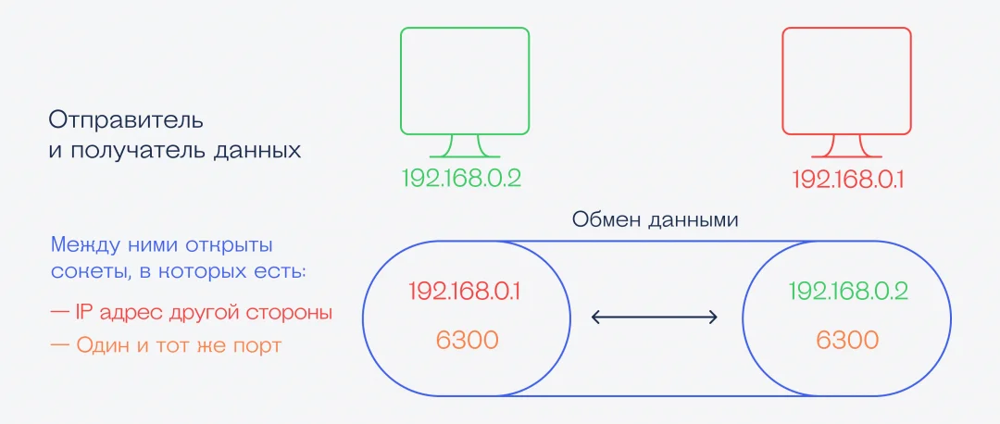
</details>

Вообще `netstat` признан устаревшим, вместо него можно использовать `ss -tulnp`:
* `-t` — показывать TCP-соединения
* `-u` — UDP-соединения
* `-l` — слушающие порты (LISTEN)
* `-n` — IP и порты в числовом формате
* `-p` — показать процесс (PID и имя)

## Part 9. Установка и использование утилит top, htop

Команда **top** позволяет отслеживать процессы и использование системных ресурсов в Linux. Что-то вроде "диспетчера задач".
* uptime — 21 min
* количество авторизованных пользователей — 1 user
* средняя загрузка системы — 0, 0, 0
* общее количество процессов — 94
* загрузка cpu — 0
* загрузка памяти — оперативная 141.9, файл подкачки 0
* pid процесса занимающего больше всего памяти — сортировка `Shift+M` — 358 (root)
* pid процесса, занимающего больше всего процессорного времени — сортировка `Shift+T` — 1252 (пользователь bubunta)

Отсортировано по памяти:

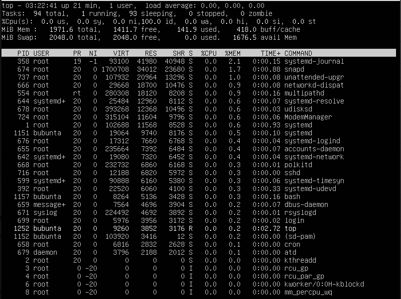

Отсортировано по времени:

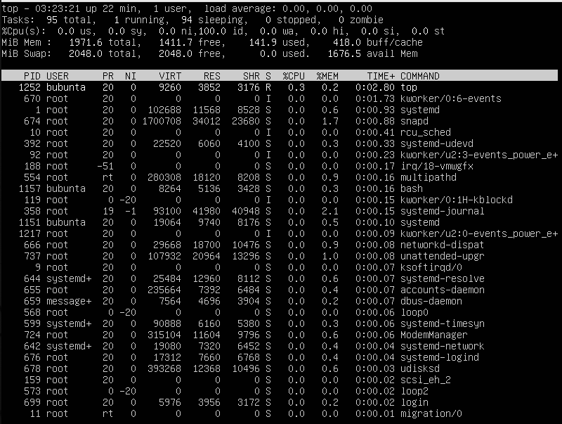

**htop** — альтернатива top.

`htop`, отсортированный по PID.

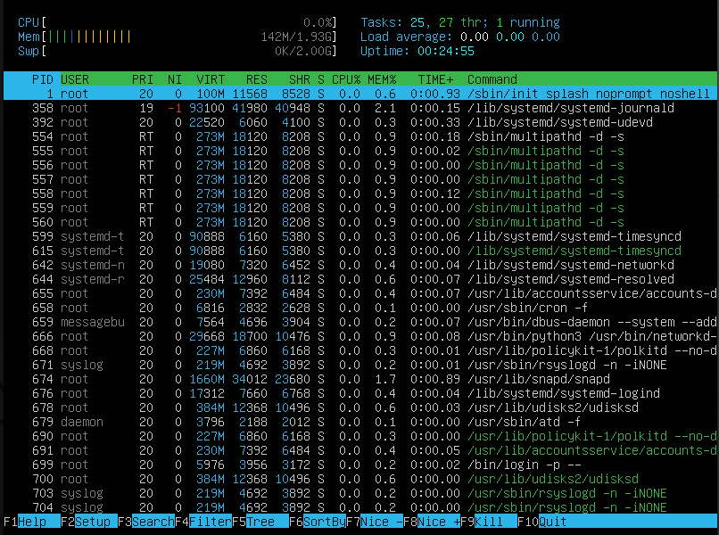

`htop`, отсортированный по PERCENT_CPU.

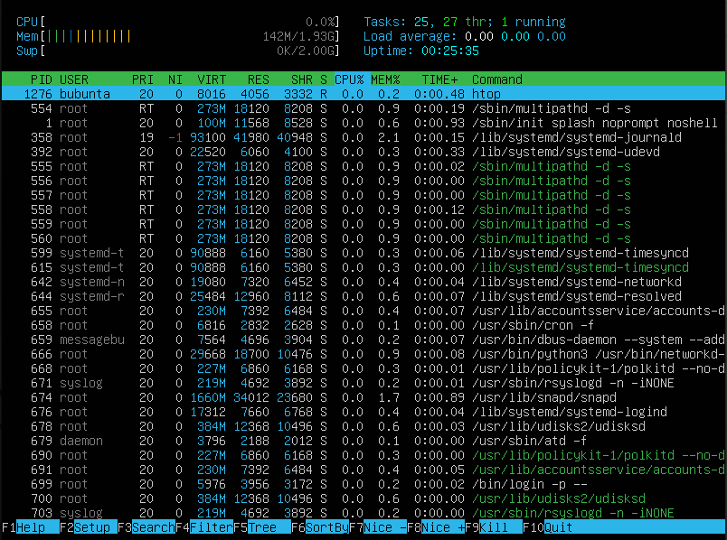

`htop`, отсортированный по PERCENT_MEM.

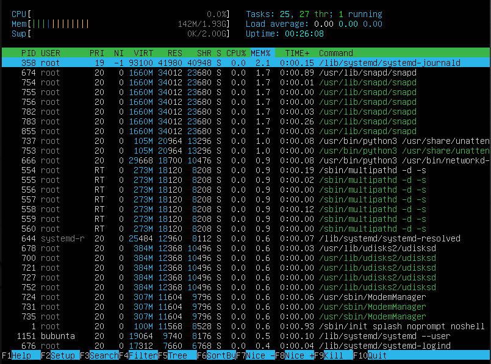

`htop`, отсортированный по TIME.

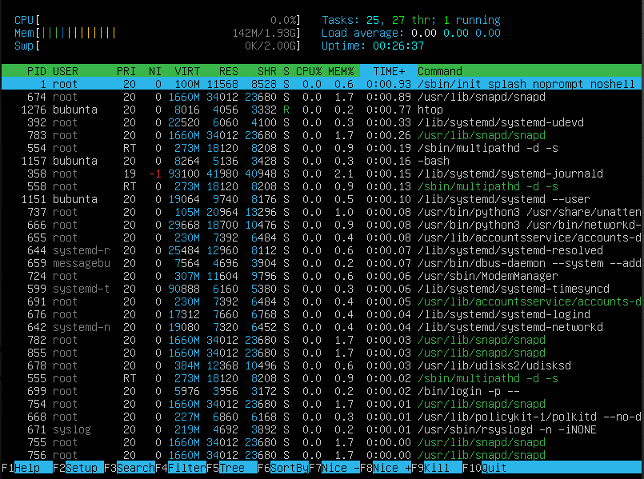

`htop`, фильтр SSH.

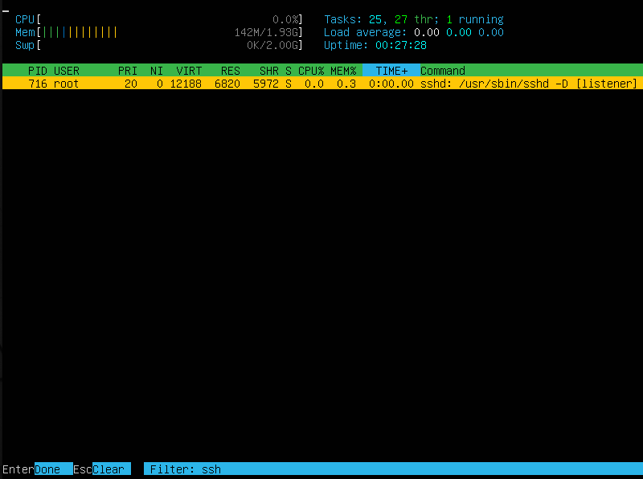

`htop`, поиск syslog.

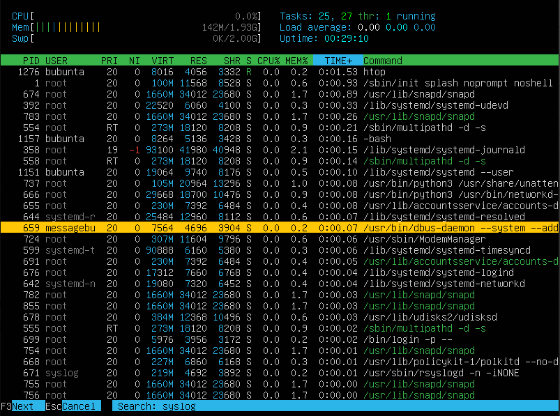

`htop`, добавлены hostname, clock и uptime. `F2 + стрелочки`.

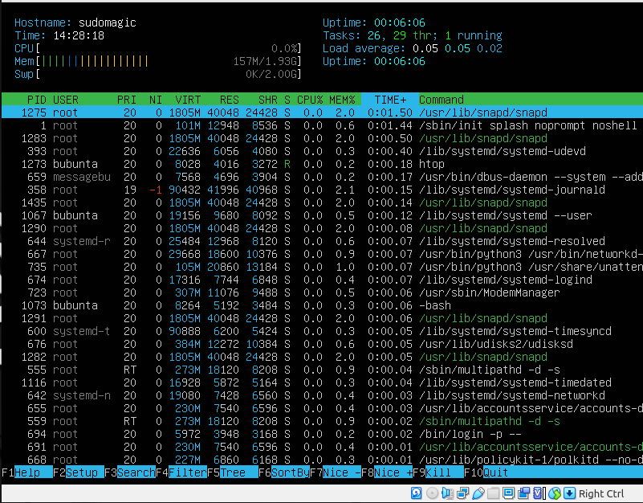

## Part 10. Использование утилиты fdisk

Команда **fdisk** (format disk, форматировать диск) — это наиболее распространенная утилита командной строки для работы с дисками в Linux. Позволяет просматривать, создавать, удалять, изменять, копировать и перемещать разделы на жестком диске, используя простой интерфейс текстовых меню.

`sudo fdisk -l` — вывод списка доступных дисков и разделов.

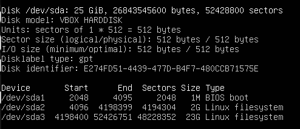

* название жёсткого диска — `/dev/sda`
* размер — 25Гб
* количество секторов — 5248800
* размер swap — вывод команды `sudo swapon --show` — 2Гб

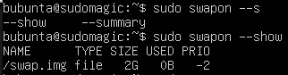

## Part 11. Использование утилиты df

**df** (disk free) — утилита в UNIX и UNIX-подобных системах, показывает список всех файловых систем по именам устройств, сообщает их размер, занятое и свободное пространство и точки монтирования. 

Основные флаги:
* `-a`, `--all` — все файловые системы, в том числе псевдо-файловые, дублирующие и недоступные.
  * Псевдо-файловые системы — файловые системы, которые имеют размер в 0 блоков и хранятся *не физически на диске, а в оперативной памяти*. По умолчанию опускаются. Представляют собой виртуальные интерфейсы к внутренним структурам ядра, которые отображаются в файловую иерархию (например, в каталоги /proc, /sys, /dev). Они не содержат реальных файлов, а создают "виртуальные" файлы и каталоги, которые обновляются в реальном времени и исчезают после перезагрузки.
* `-B <SIZE>`, `--block-size=<SIZE>` — выдаёт размеры в блоках <SIZE> байт.
* `-h`, `--human-readable` — добавляет к каждому размеру букву (K, M, G), блоки по 1024 байт (не 1000, как по умолчанию). 
* `-H`, `--si` — как `-h`, но блоки по 1000 байт, т.е. кило, мега и гига (киби, меби и гиги — 1024!!!).
* `-T`, `--print-type` — тип файловой системы.
* `-t <TYPE>`, `--type=<TYPE>` — вывод только файловых систем типа <TYPE>.
* `-x <TYPE>`, `--exclude-type=<TYPE>` — не показывать файловые системы с заданным <TYPE>.
* `-i`, `--inodes` — вместо блоков вывести информацию об использовании индексных дескрипторов в файловой системе (а что это такое — написано в первом лирическом отступлении).
* `-l`, `--local` — выводит только данные о локальных файловых системах. Без флага выводит и об удалённых.

<details><summary>Просто картинка с видами файловых систем. Без лирики, потому что тяжело</summary>

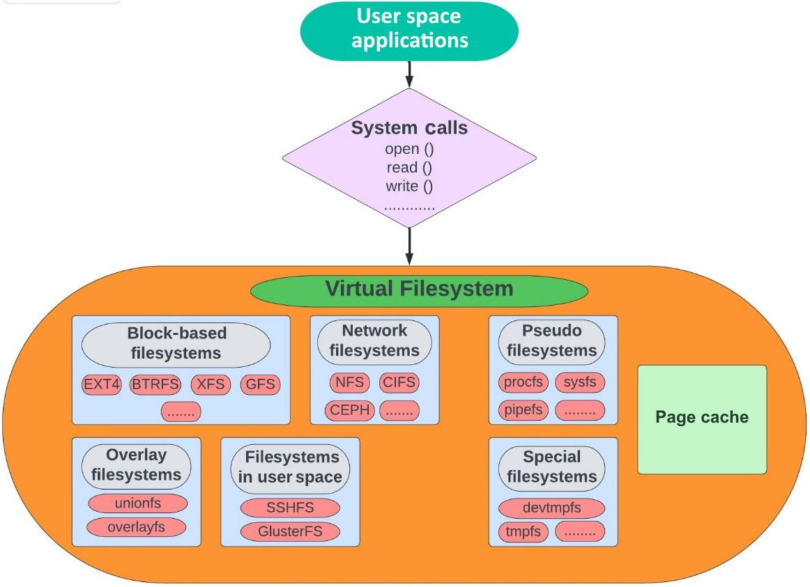

Подробное падение в кроличью нору <http://onreader.mdl.ru/ArchitectureDesignLinuxStorageStack/content/Ch01.html> автор внизу даже оставил ссылки на учебники
</details>

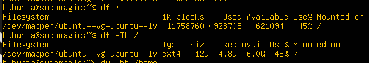

`df /`:
* размер раздела — 11 758 760 КиБ
* размер занятого пространства — 4 928 708 КиБ
* размер свободного пространства — 6 120 944 КиБ
* процент использования — 45%
* единица измерения — **КИБИ**байты (КиБ). 1 **киби**байт = 1024 байт. А килобайт = 1000 байт. 

Damn, взрыв мозга, в килобайте не 1024 байт... хотя когда-то в школе был взрыв, что 1024, а не 1000. А оно на самом деле вот как...

`df -Th /`:
* размер раздела — 12 ГиБ (гигибайт = 1024 мебибайт, 1 мебибайт = 1024 кибибайт)
* размер занятого пространства — 4.8 ГиБ
* размер свободного пространства — 6 ГиБ
* процент использования — 45%
* тип файловой системы для раздела — `ext4`

## Part 12. Использование утилиты du

**du** — команда в Linux, которая позволяет отобразить количество дискового пространства, используемого файлами и каталогами.

Основные флаги:
* `-a`, `--all` — показывать размеры для всех встретившихся файлов, а не только для каталогов.
* `--apparent-size` — действительные размеры вместо занимаемого пространства на устройстве; как правило, действительный размер меньше занимаемого места, но он может быть больше из-за «дыр» в («разрежённых») файлах, внутренней фрагментации, блоков косвенной адресации (indirect blocks) и тому подобного.
* `-B <SIZE>`, `--block-size=<SIZE>` — выдаёт размеры в блоках <SIZE> байт.
* `-h`, `--human-readable` — добавляет к каждому размеру букву (K, M, G), блоки по 1024 байт. 
* `--si` — как `-h`, но блоки по 1000 байт, т.е. кило, мега и гига, НЕ киби, меби и гиги (которые по 1024).
* `-c`, `--total` — общий итог.
* `-d <N>`, `--max-depth=<N>` — общий итог для каталога (или файла, если задана опция -a ), только если он находится не более чем на <N> уровней глубины ниже заданного в командной строке аргумента; `--max-depth=0` означает то же самое, что и опция `-s`.
* `-s`, `--summarize` — только итог без вывода подкаталогов.
* `-S`, `--separate-dirs` — выводит размер каждого каталога, исключая подкаталоги из подсчета (т.е., например, указанный размер папки может быть меньше подпапки).
* `--time` — время последнего изменения для каждого файла в каталоге и его подкаталогах.
* `-t`, `--threshold=<SIZE>` — не учитывать файлы и папки с размером меньше <SIZE>.
* `--exclude=<ШАБЛОН>` — пропускать каталоги или файлы, чьи имена содержат <ШАБЛОН>.
* `--inodes` — вывести информацию об использовании индексных дескрипторов вместо блоков.

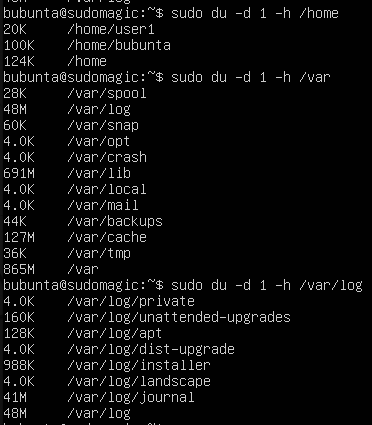

`du -d 1 -h` — выводить человекочитаемые размеры директорий глубиной 1 (чтоб с ncdu можно было потом сравнить).
`/home` — 124 КиБ
`/var` — 865 МиБ
`/var/log` — 48 МиБ

`du -sh /var/log/*` — вывести человекочитаемые размеры всех файлов, но кратко (`-s`).

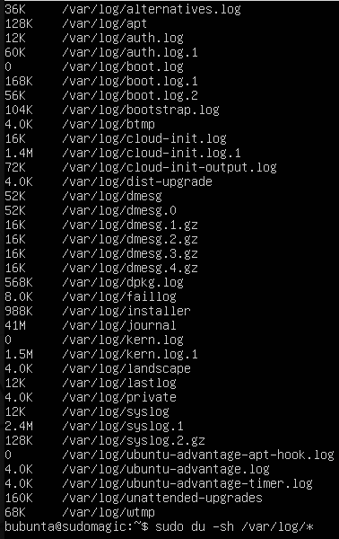

<details><summary>Некрасивые скриншоты, сделанные на всякий случай</summary>

`du -h /home`

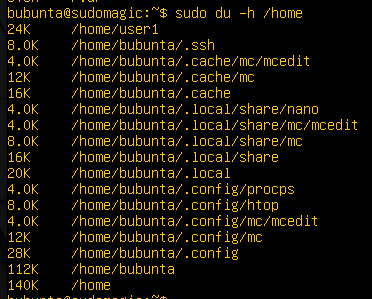

`du -h /var`

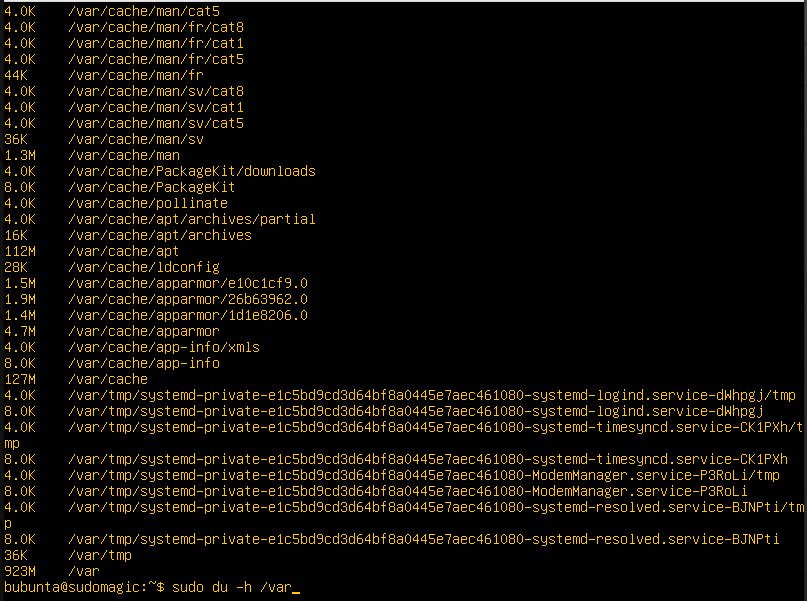

`du -h /var/log`

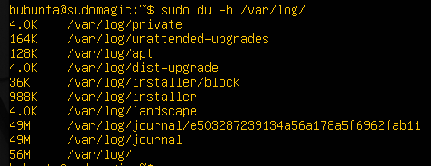

`du -ha /var/log/*`

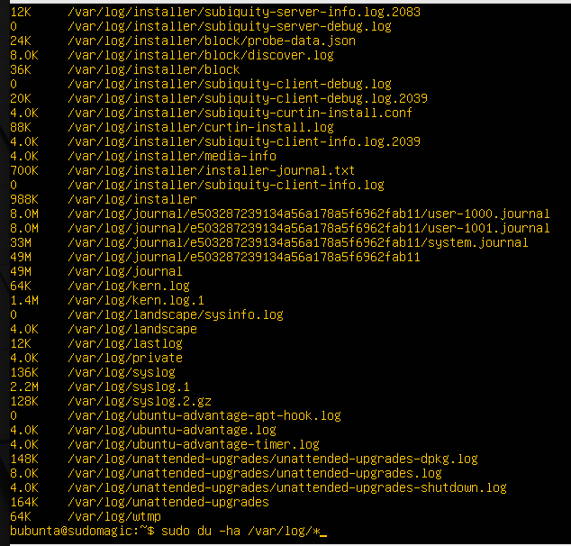
</details>

## Part 13. Установка и использование утилиты ncdu

**ncdu** (NCurses Disk Usage) — версия известной команды `du` на основе curses (ncurses), которая позволяет быстро узнать, какие каталоги занимают место на вашем диске.

`/home` — 124 КиБ

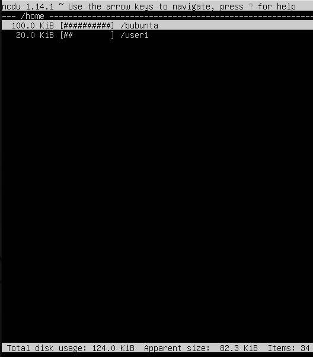

`/var` — 859,4 МиБ

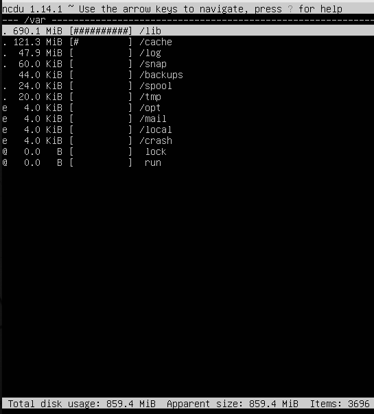

`/var/log` — 47,9 МиБ

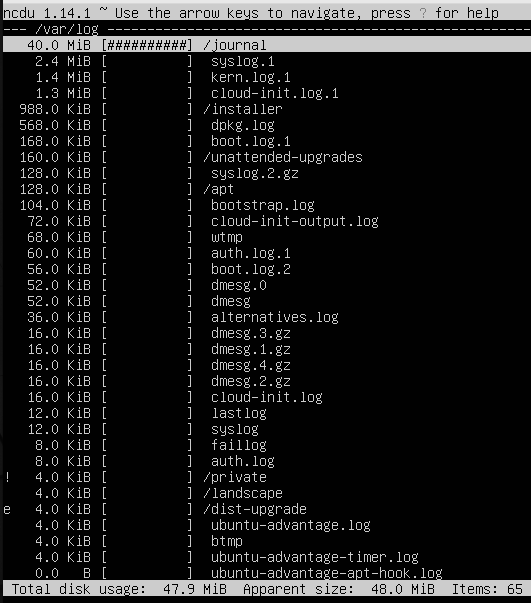

## Part 14. Работа с системными журналами

**Логи** (журнал сервера, англ. server log) – это записываемые фрагменты данных, описывающие то, что в конкретный момент времени делает сервер, ядро, службы и приложения. 

До `systemd` все события складывались в `/var/log/`. Потом появилась `systemd` — подсистема инициализации и управления службами в Linux, которая собирает выходные данные служб и процессов и записывает их в журнал. Для работы с логами `systemd` используется система журналирования `journalctl`

Возвращаемся к заданию:
1. `/var/log/dmesg` — логи драйверов.
2. `/var/log/syslog` (может быть в `/var/log/messages`) — глобальные системные логи Linux, в том числе те, которые регистрируются при запуске системы.
3. `/var/log/auth.log` (может быть в `/var/log/secure`) — информация об авторизации пользователей в системе, включая пользовательские логины и механизмы аутентификации, которые были использованы.

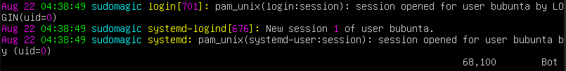

* время последней успешной авторизации: 4:38:49
* имя пользователя: bubunta
* метод входа в систему: by LOGIN(uid=0)

Лог после перезапуска демона SSH (😈)

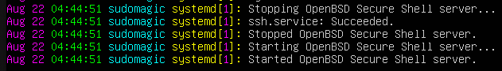

<https://www.securitylab.ru/blog/personal/Neurosinaps/355442.php>
<https://losst.pro/kak-posmotret-logi-v-linux>
<https://habr.com/ru/articles/332502/>

## Part 15. Использование планировщика заданий CRON

**cron** — классический *демон* 😈, использующийся для периодического выполнения заданий в определённое время. Регулярные действия описываются инструкциями, помещенными в файлы `crontab` и в специальные каталоги. Эти файлы сильно не рекомендуются изменять вручную, лучше использовать команду `crontab`.

Флаги `crontab`:
* `-l` — вывод содержимого текущего файла расписания.
* `-r` — удаление текущего файла расписания.
* `-e` — редактирование файла расписания.

Таблица `crontab` состоит из 6 колонок, разделяемых пробелами или табуляторами: 
```
минута час день месяц день_недели /ПОЛНЫЙ/путь/к/исполняемому/файлу
```
Дата и время указываются с помощью `цифр` или:
* `*` — означает, что нужно выполнять каждый раз: если в первом поле, то каждую минуту и так далее.
* `A-B` — интервал с A до B минут/часов и т.п.
* `A,B` — запуск несколько раз в 5 и 35 минут/часов и т.п.
* `*/A` — интервал раз в A минут/часов и т.п.

Примеры:
* `0 * * * * /usr/local/bin/serve` — каждый час в 0-ю минуту.
* `0 0 * * * /usr/local/bin/serve` — каждый день в 0 часов 0 минут (12 ночи).
* `30 15 * * 2 /usr/local/bin/serve` — каждый вторник в 15:30 (понедельник = 1, воскресенье = 7, ещё можно писать сокращённо sun).
* `0 7-19 * * * /usr/local/bin/serve` — каждый час с 7 утра до 19 вечера.
* `5,35 16 * * * /usr/local/bin/serve` — каждый день в 16:05 и 16:35.
* `*/10 * * * * /usr/local/bin/serve` — каждые 10 минут.

А для нашей задачи: `*/2 * * * * uptime`. Но на экран ничего не выведется, хотя в логах вызовы будут зафиксированы. С выводом: `*/2 * * * * uptime | wall`

**wall** (от **W**rite **ALL**) — эта команда отправляет сообщение ВСЕМ пользователям, подключенным к системе (во все их терминалы). 

Вывод текущих задач `crontab -l`:

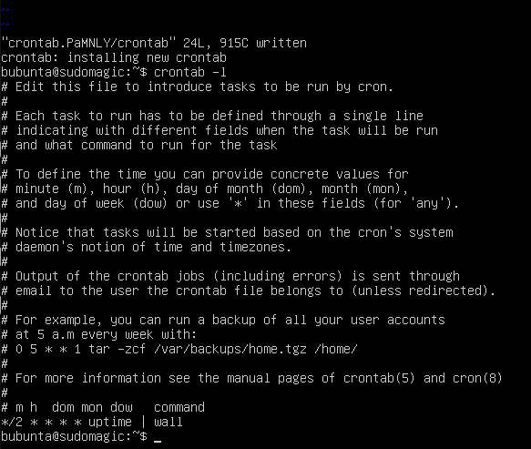

Вывод команды uptime в консоли:

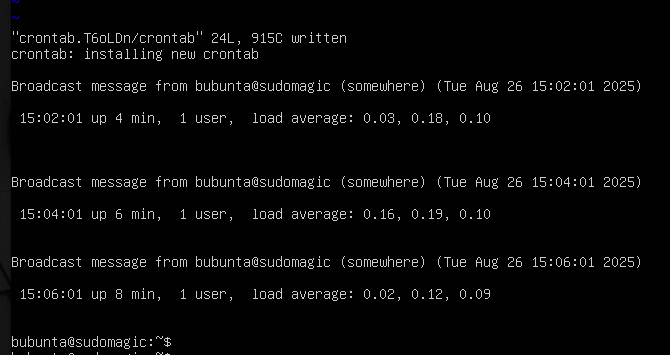

Вызовы uptime, записанные в `syslog`:

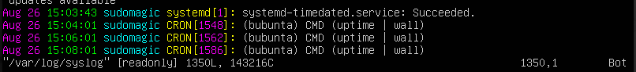

Вывод `crontab -l` и удаление задач `crontab -r`

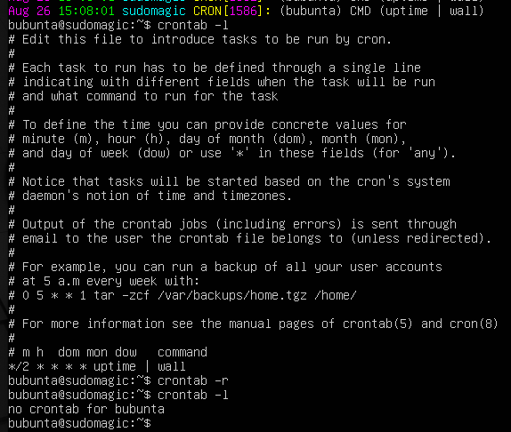
